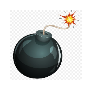

# Minesweeper
Minesweeper is single-player logic-based computer game played on rectangular board whose object is to locate a predetermined number of randomly-placed "mines" in the shortest possible time by clicking on "safe" squares while avoiding the squares with mines.

The simple Rules for Minesweeper: 

To win a round of Minesweeper, you must click on the board every square that doesn't have a mine under it. Once you've done so, the game will be over. If you accidentally click a square that has a mine beneath it, the game will be over. You'll have the option of starting a new game or redoing the one you just played.

# Screenshot

# Technologies Used

- JavaScript
- HTML
- CSS

# Getting Started

[Click to View Project Planning](your Trello url here)
[Click to Play Minesweeper](your deployment url here)

# Next Steps

- Future enhancement one...Timer to allow fixed time to finish the game.
- Future enhancement two...Difficulty levels. 